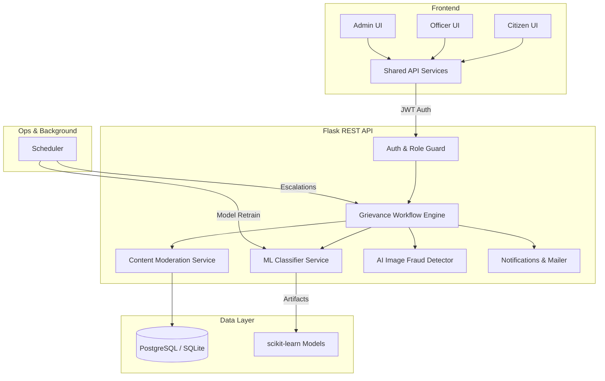
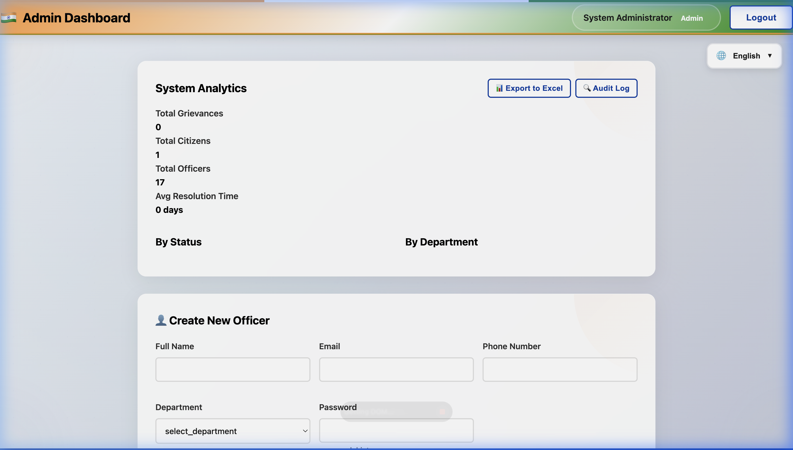
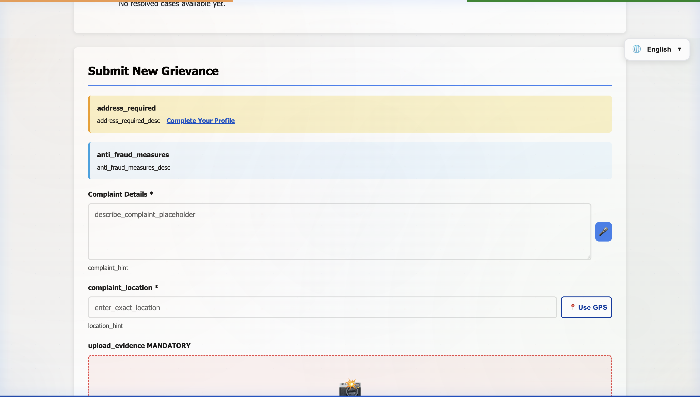

# 🚀 Public Service Operations Platform
### AI-Powered Case Management & Smart Grievance Redressal

[](https://github.com/Santhakumarramesh/smart-grievance-system/actions/workflows/ci.yml)
[](https://opensource.org/licenses/MIT)

> **"Built a production-oriented public service operations platform with ML-assisted routing, SLA enforcement, fraud lifecycle management, and multilingual UI, supporting role-based workflows for citizens, officers, and administrators."**

A **production-oriented**, full-stack case management platform designed to automate public service operations. This system handles the entire lifecycle of a citizen's grievance—from AI-assisted routing to SLA-tracked resolution and fraud prevention.

---

## 📖 The Project Story

### The Problem
Public service departments often struggle with "triage bottlenecks." Complaints are manually sorted, status updates are opaque to citizens, and accountability for response times (SLAs) is difficult to enforce at scale. This leads to slow resolution and a lack of trust in public services.

### The Approach
I built this platform to transition from a "complaint website" to a **comprehensive operations engine**. By integrating a scikit-learn ML pipeline for automated department routing and a background scheduler for SLA monitoring, the system reduces manual labor and ensures that no case is lost in the bureaucracy.

### The Outcome
A hardened, role-based platform that provides:
- **For Citizens**: High transparency through status timelines and dual-language translation support.
- **For Officers**: Streamlined workflows for investigations, evidence reviews, and fraud reporting.
- **For Admins**: Observability via system analytics, model monitoring, and account suspension workflows.

---

## 🏗️ Architecture & Tech Stack



### 🔁 System Flow
```text
Citizen → Submit Grievance
        ↓
ML Classifier → Department Prediction
        ↓
Admin (if low confidence fallback)
        ↓
Officer Assignment
        ↓
Workflow Updates + SLA Tracking
        ↓
Fraud Review (optional)
        ↓
Resolution → Citizen Notification
```

### 🛠️ Tech Stack (Specific)
- **Backend**: Flask, SQLAlchemy, JWT, Pytz (Timezone handling), Bleach (XSS Sanitization).
- **ML/AI**: scikit-learn (TF-IDF + Logistic Regression), manual triage fallback.
- **Frontend**: Vanilla JS (Modular ESM), CSS (Rich/Premium Aesthetics).
- **Infra/CI**: Render Dashboard, GitHub Actions CI, PostgreSQL.
- **Security**: IP-based rate limiting, input validation, SQL injection prevention.

---

## 🚀 Quick Demo Flow

1. **Citizen Submission**: Register and submit a grievance. The system automatically predicts the department and applies moderation.
2. **Automated Triage**: High-confidence cases auto-route to the department; low-confidence cases go to the Admin Triage queue.
3. **Officer Action**: Assigned officer reviews evidence (including AI fraud scan), updates status, and investigations.
4. **Accountability**: SLA tracking ensures the case remains on schedule; background tasks escalate breached cases.
5. **Transparency**: Citizen receives email notifications and tracks real-time progress on their personal timeline.


*Professional Dashboard: Real-time analytics and grievance management.*


*Citizen Transparency: Detailed lifecycle tracking with automated status updates.*

---

## 🧩 System Strengths (Engineering Thinking)

- **Confidence-Aware ML Routing**: Implements a human-in-the-loop fallback for low-confidence classifications, preventing routing errors.
- **SLA-Driven Enforcement**: Automated breach detection via background scheduler ensures operational accountability.
- **Full Fraud Lifecycle**: Officers can flag suspicion; Admins verify via evidence and execute audit-backed suspensions.
- **Role-Based Security**: Strict backend enforcement of role permissions across all protected API routes.
- **Isolated Side-Effect Testing**: Deterministic test suite using mocks for Email/Notification services to ensure CI reliability.
- **Multilingual UI Architecture**: Scalable localization engine supporting dynamic translation across complex workflows.

---

## 🛠️ Feature Matrix

| Feature | Citizen | Officer | Admin |
|---|:---:|:---:|:---:|
| **Submit Grievance** (ML Routed) | ✅ | | |
| **Evidence Upload** (AI Fraud Scan) | ✅ | | |
| **Real-time Status Timeline** | ✅ | ✅ | ✅ |
| **Multilingual UI** (EN, HI, TA) | ✅ | ✅ | ✅ |
| **Advanced Search & Filtering** | | ✅ | ✅ |
| **Fraud Reporting & Suspicion** | | ✅ | |
| **Fraud Review & Account Suspension** | | | ✅ |
| **SLA Monitoring & Escalation** | ✅ | ✅ | ✅ |
| **Department & User Management** | | | ✅ |
| **ML Model Status & Retrain** | | | ✅ |

---

## 🔌 API Overview

- `/api/auth/*` → Authentication, Profile Management, Password Reset (OTP).
- `/api/grievances/*` → Submission, Workflow Updates, Comments, Fraud Reports.
- `/api/admin/*` → Assignment, Analytics, Moderation Review, Model Control.
- `/api/notifications/*` → In-app and Email event triggers.

---

## 🌍 Multilingual Support
The platform features a custom-built translation architecture.
- **Fully Populated**: English (EN), Hindi (HI), Tamil (TA).
- **Extended Architecture**: Supports up to 12 Indian languages with dynamic wiring.

---

## ⚠️ Known Limitations
- **Content Coverage**: Full translation coverage is currently complete for English, Hindi, and Tamil; remaining languages use fallback keys.
- **ML Specialization**: The classifier is optimized for department routing assistance, not high-granularity sub-category classification.
- **Session Strategy**: Token storage currently uses `localStorage` for simplicity; production environments should migrate to HttpOnly secure cookies.
- **Detection Dependency**: AI image fraud detection depends on model confidence thresholds and may require manual verification.

---

## 🚀 Quick Start (Local Development)

1. **Clone & Setup**:
   ```bash
   git clone https://github.com/Santhakumarramesh/smart-grievance-system.git
   cd smart-grievance-system
   pip install -r requirements.txt
   ```
2. **Bootstrap Database**:
   ```bash
   python -m flask --app backend.app:create_app db upgrade
   python manage.py seed
   ```
3. **Run Application**:
   ```bash
   python run.py
   ```
   *Access at: [http://localhost:8000](http://localhost:8000)*

> [!WARNING]
> **Demo Credentials**: `admin123` / `officer123` / `citizen123` are for local development only. Do not use in production.

> [!NOTE]
> **Live Demo**: The [GitHub Pages demo](https://santhakumarramesh.github.io/smart-grievance-system/) is a frontend-mirrored demo. Backend services must be deployed separately for full logic fulfillment.

---

## 💼 Interview Toolkit

### The "60-Second" Project Summary
*"I built a Smart Grievance Operations Platform that automates complaint routing using an ML classifier, enforces SLA-based accountability, and includes a full fraud review lifecycle. The system supports three roles—citizens, officers, and admins—with backend-enforced workflows, notifications, and escalation tracking. I also implemented deterministic testing for workflow and side effects, and added multilingual UI support to make it scalable for public use."*

---

## 🤝 License
MIT License. Created by [Santhakumar Ramesh](https://github.com/Santhakumarramesh).
